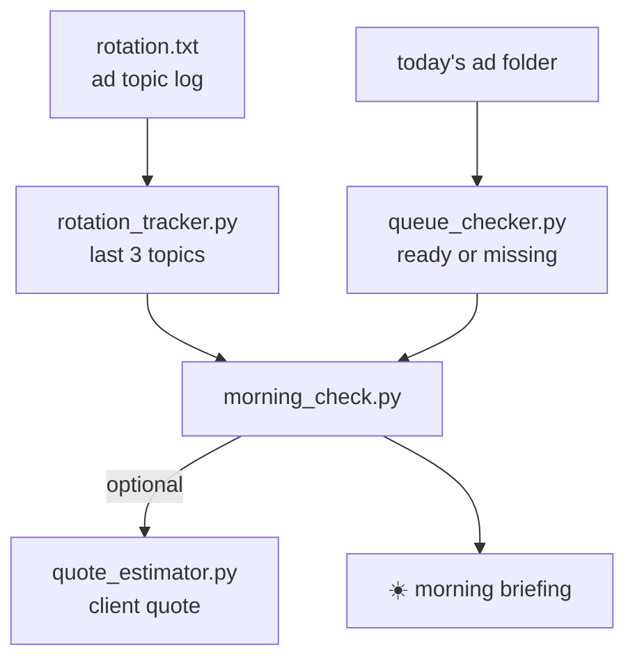

# 🤖 ai-agents

<p align="center">
  
  
  
  
</p>

> I'm Thai. I run two businesses in Sacramento, CA — **Golden State Signature** (mobile notary) and **OX Beauty Services** (mobile hair).
> This repo collects the **AI agents and automations I'm building** across all of it.
> No tutorial exercises: everything here does a real job in a real business.

---

## 📁 What's inside

### notary-automation — *chapter one*

Python tools that run my notary admin every morning. Built week by week while learning Python.

| Script | Does what | Run it |
|---|---|---|
| 🌅 `morning_check.py` | The daily scan — last 3 ad topics (don't repeat!), today's 4 ad graphics: ready or missing, plus an optional client quote | `python3 morning_check.py` |
| 🔁 `rotation_tracker.py` | Reads `rotation.txt`, prints the last 3 ad topics so I never repeat one | `python3 rotation_tracker.py` |
| ✅ `queue_checker.py` | Checks whether today's 4 ad files (`YYYY-MM-DD-fb/ig1/fb2/ig2.png`) exist yet — the date fills in automatically | `python3 queue_checker.py` |
| 🧾 `quote_estimator.py` | Interactive quote: signatures + travel + after-hours fee, with military discount | `python3 quote_estimator.py` |



### 🗺️ Coming next

- **ox-beauty** — automations for my mobile hair business
- **gss-agents** — agent workflows behind my notary marketing pipeline

---

## 🧪 Try it in 30 seconds

```bash
git clone https://github.com/oxayavongsa/ai-agents.git
cd ai-agents
cp data/rotation_sample.txt rotation.txt
python3 morning_check.py
```

<details>
<summary>📱 <b>Run it on your phone</b> — no computer needed</summary>

1. Install **Pydroid 3** (free, Play Store)
2. Paste any script into a new file, tap run
3. Same code, zero changes

</details>

<details>
<summary>🖥️ <b>Run it on your computer</b></summary>

1. Install Python from [python.org](https://www.python.org/downloads/)
2. Save a script as `something.py`, then run `python3 something.py`

</details>

---

## 📓 Learning log

<details>
<summary><b>Week 1</b> — talk to the computer: print, variables, strings, input</summary>

Capstone: rotation tracker v1 — hardcoded topics, printed back. The "hello world" of my ad pipeline.
</details>

<details>
<summary><b>Week 2</b> — work through lists: lists, loops, files</summary>

Capstones: rotation tracker v2 (reads the real `rotation.txt`) and the post-queue checker (which of today's ad files exist?).
</details>

<details>
<summary><b>Week 3</b> — think in functions: functions, dicts, math</summary>

Capstone: the quote estimator — signatures + travel + after-hours + military discount, all from my own rate sheet.
</details>

<details>
<summary><b>Week 4</b> — the morning pipeline</summary>

Capstone: `morning_check.py` — all three areas in one scan, with a one-line verdict at the end.
</details>

---

## ⚠️ One honest note

Rates in `quote_estimator.py` come from my own sheet. `MILEAGE_RATE` is marked in the code — update it whenever the IRS updates the business mileage rate.

---

<p align="center">
  <sub>Built while learning · Sacramento, CA · Golden State Signature · OX Beauty Services</sub>
</p>
